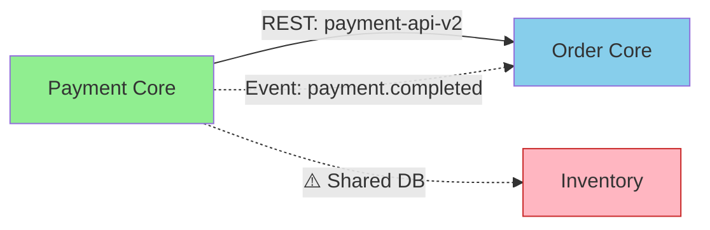

# Vision & Roadmap: Complete Bounded Context Mapping for Kotlin Microservices

**Author:** Architecture Team  
**Date:** October 14, 2025  
**Status:** 📋 Planning Phase  
**Goal:** Automatic discovery and visualization of DDD/BIAN bounded context relationships

---

## 🎯 Vision Statement

**Build an intelligent system that automatically analyzes Kotlin microservice repositories to generate comprehensive bounded context maps, detect architectural anti-patterns, and visualize the complete enterprise architecture landscape aligned with DDD and BIAN principles.**

---

## 🌟 The Big Picture

### Current State (✅ Achieved)
- 20 Kotlin microservices cataloged
- API producer/consumer relationships mapped from build.gradle
- Automatic scheduled refresh (every 30 minutes)
- HTTP APIs for querying relationships

### Future State (🎯 Target)
- **Complete Context Map**: All integration patterns automatically discovered
- **Anti-pattern Detection**: Shared databases, tight coupling, circular dependencies
- **Event-Driven Visibility**: Full Kafka topic producer/consumer graph
- **Shared Kernel Tracking**: Internal library dependencies and shared models
- **Interactive Visualization**: D3.js/React Flow context map diagrams
- **BIAN Alignment**: Service domain classification and maturity assessment
- **Architecture Governance**: Automated compliance checks and recommendations

---

## 📊 What We'll Extract from Kotlin Services

### Data Sources Overview

| Source File | Information Extracted | BC Mapping Value |
|------------|----------------------|------------------|
| **build.gradle.kts** | • API dependencies (✅ done)<br>• Shared internal libraries<br>• Technology stack<br>• Framework versions | **Shared Kernel**<br>**Open Host Service**<br>**Technology maturity** |
| **application.yml** | • Database connections<br>• Kafka configuration<br>• Service ports<br>• External integrations | **⚠️ Shared Database**<br>**Published Language**<br>**Infrastructure map** |
| **Kotlin Sources** | • @KafkaListener annotations<br>• Event topic constants<br>• gRPC services<br>• REST controllers | **Event consumers**<br>**Event producers**<br>**API specifications** |
| **docker-compose.yml** | • Service dependencies<br>• Shared infrastructure<br>• Network topology | **Deployment coupling**<br>**Infrastructure patterns** |
| **README.md** | • Integration docs<br>• API contracts<br>• Event schemas | **Human documentation**<br>**Design intent** |

---

## 🗺️ Complete Context Mapping Features

### Phase 1: Foundation (Current) ✅
**Status:** Complete  
**Deliverables:**
- [x] Build.gradle.kts OpenAPI relation parsing
- [x] API producer/consumer detection
- [x] Component entity enrichment (providesApis/consumesApis)
- [x] HTTP API endpoints for querying relationships
- [x] Scheduled automatic refresh
- [x] Manual refresh endpoint

**Value Delivered:**
- Real-time API dependency tracking
- Impact analysis for API changes
- API consumer/provider discovery

---

### Phase 2: Database & Kafka Discovery 🔄
**Status:** Planned  
**Timeline:** Q1 2026  
**Estimated Effort:** 2-3 weeks

#### 2.1 application.yml Parser

**Files to Parse:**
```
src/main/resources/application.yml
src/main/resources/application.yaml
src/main/resources/application-{profile}.yml
```

**Extract:**
```yaml
spring:
  datasource:
    url: jdbc:postgresql://payment-db.prod:5432/payments
    # → Host, DB name, DB type
    
  kafka:
    bootstrap-servers: kafka.prod:9092
    consumer:
      group-id: payment-service
    producer:
      client-id: payment-service
      
kafka:
  topics:
    payment-completed: "payment.events.completed"
    order-created: "order.events.created"
```

**Detection Logic:**

1. **Database Connection Parsing**
```typescript
interface DatabaseConnection {
  service: string;
  host: string;
  port: number;
  database: string;
  type: 'postgresql' | 'mysql' | 'mongodb' | 'oracle';
  schema?: string;
}

// Parse JDBC URL: jdbc:postgresql://host:port/database
const dbPattern = /jdbc:(\w+):\/\/([\w.-]+):?(\d+)?\/([\w-]+)/;
```

2. **Kafka Configuration Parsing**
```typescript
interface KafkaConfig {
  service: string;
  bootstrapServers: string;
  consumerGroupId?: string;
  producerClientId?: string;
  topics: {
    [key: string]: string;  // config key → topic name
  };
}
```

**Anti-pattern Detection:**
```typescript
// Shared Database Detection
function detectSharedDatabases(connections: DatabaseConnection[]): SharedDbWarning[] {
  const dbMap = groupBy(connections, c => `${c.host}:${c.database}`);
  
  return Object.entries(dbMap)
    .filter(([_, services]) => services.length > 1)
    .map(([db, services]) => ({
      database: db,
      services: services.map(s => s.service),
      severity: 'HIGH',
      pattern: 'SHARED_DATABASE',
      recommendation: 'Split database per bounded context'
    }));
}
```

**Deliverables:**
- [x] `fetchAndParseApplicationYml()` function
- [x] Database connection extraction
- [x] Kafka configuration extraction
- [x] Shared database detection
- [x] Entity enrichment with DB/Kafka metadata

**Value:**
- Identify shared database anti-patterns ⚠️
- Map event-driven architecture
- Detect infrastructure coupling

---

### Phase 3: Kotlin Source Analysis 🔄
**Status:** Planned  
**Timeline:** Q2 2026  
**Estimated Effort:** 3-4 weeks

#### 3.1 Kafka Event Detection

**Search Patterns:**

**A. Kafka Listeners (Consumers)**
```kotlin
// Pattern 1: Annotation with constant
@KafkaListener(topics = ["payment.events.completed"])
fun handlePaymentCompleted(event: PaymentEvent) { ... }

// Pattern 2: Annotation with reference
@KafkaListener(topics = [Topics.PAYMENT_COMPLETED])
fun handlePaymentCompleted(event: PaymentEvent) { ... }

// Pattern 3: Multiple topics
@KafkaListener(topics = ["topic1", "topic2"], groupId = "my-service")
fun handleEvents(event: Event) { ... }
```

**Regex Pattern:**
```typescript
const kafkaListenerPattern = /@KafkaListener\s*\(\s*topics\s*=\s*\[([\s\S]*?)\]/g;
```

**B. Kafka Producers**
```kotlin
// Pattern 1: Direct send
kafkaTemplate.send("payment.events.completed", event)

// Pattern 2: Constant reference
kafkaTemplate.send(Topics.PAYMENT_COMPLETED, event)

// Pattern 3: @Value injection
@Value("\${kafka.topics.payment-completed}")
private lateinit var paymentTopic: String

fun publish() {
    kafkaTemplate.send(paymentTopic, event)
}
```

**C. Topic Constants**
```kotlin
object Topics {
    const val PAYMENT_COMPLETED = "payment.events.completed"
    const val ORDER_CREATED = "order.events.created"
    const val REFUND_REQUESTED = "payment.events.refund-requested"
}
```

#### 3.2 gRPC Service Detection

```kotlin
// Pattern 1: gRPC service implementation
@GrpcService
class PaymentServiceGrpc : PaymentServiceGrpcKt.PaymentServiceCoroutineImplBase() {
    override suspend fun createPayment(request: CreatePaymentRequest): CreatePaymentResponse {
        // ...
    }
}

// Pattern 2: gRPC client
@Component
class OrderServiceClient(
    @GrpcClient("order-service") 
    private val orderStub: OrderServiceGrpcKt.OrderServiceCoroutineStub
) { ... }
```

#### 3.3 REST API Detection

```kotlin
@RestController
@RequestMapping("/api/v1/payments")
class PaymentController {
    
    @GetMapping("/{id}")
    fun getPayment(@PathVariable id: String): PaymentDto { ... }
    
    @PostMapping
    fun createPayment(@RequestBody request: CreatePaymentRequest): PaymentDto { ... }
}
```

**Implementation Strategy:**

1. **GitHub Code Search API**
```typescript
async function searchKotlinFiles(
  repo: string, 
  pattern: string
): Promise<SearchResult[]> {
  // Use GitHub Code Search API
  const query = `repo:${repo} language:Kotlin ${pattern}`;
  return await githubApi.search.code({ q: query });
}
```

2. **File Pattern Matching**
```typescript
const filesToSearch = [
  'src/main/kotlin/**/kafka/**/*.kt',
  'src/main/kotlin/**/events/**/*.kt',
  'src/main/kotlin/**/messaging/**/*.kt',
  'src/main/kotlin/**/grpc/**/*.kt',
  'src/main/kotlin/**/controller/**/*.kt',
];
```

3. **Content Analysis**
```typescript
async function extractKafkaTopics(fileContent: string): Promise<KafkaTopic[]> {
  const listeners = extractListeners(fileContent);
  const producers = extractProducers(fileContent);
  const constants = extractTopicConstants(fileContent);
  
  return resolveTopicReferences(listeners, producers, constants);
}
```

**Deliverables:**
- [ ] GitHub Code Search integration
- [ ] Kafka listener annotation parser
- [ ] Kafka producer detection
- [ ] Topic constant resolution
- [ ] gRPC service discovery
- [ ] REST controller mapping
- [ ] Event schema extraction

**Value:**
- Complete event-driven architecture map
- gRPC dependency graph
- REST API inventory
- Producer/consumer relationship matrix

---

### Phase 4: Shared Library Analysis 🔄
**Status:** Planned  
**Timeline:** Q2 2026  
**Estimated Effort:** 1-2 weeks

#### 4.1 Internal Dependency Detection

**Extract from build.gradle.kts:**
```kotlin
dependencies {
    // Internal shared libraries (Shared Kernel pattern)
    implementation("com.company:payment-domain-models:1.0.0")
    implementation("com.company:common-events:2.0.0")
    implementation("com.company:shared-utils:1.5.0")
    
    // External libraries (for stack analysis)
    implementation("org.springframework.boot:spring-boot-starter-web")
    implementation("io.grpc:grpc-kotlin-stub:1.50.0")
}
```

**Detection Logic:**
```typescript
interface SharedLibrary {
  groupId: string;
  artifactId: string;
  version: string;
  type: 'internal' | 'external';
  usedBy: string[];  // services using this library
}

function detectSharedKernel(dependencies: Dependency[]): SharedKernelPattern[] {
  const internalLibs = dependencies.filter(d => 
    d.groupId.startsWith('com.company') || 
    d.groupId.startsWith('com.yourorg')
  );
  
  // Group by library
  const libUsage = groupBy(internalLibs, l => `${l.groupId}:${l.artifactId}`);
  
  // Identify shared (used by multiple services)
  return Object.entries(libUsage)
    .filter(([_, services]) => services.length > 1)
    .map(([lib, services]) => ({
      library: lib,
      services: services.map(s => s.service),
      pattern: 'SHARED_KERNEL',
      risk: services.length > 5 ? 'HIGH' : 'MEDIUM',
      recommendation: 'Review if shared domain models are appropriate'
    }));
}
```

**Version Conflict Detection:**
```typescript
function detectVersionConflicts(dependencies: Dependency[]): VersionConflict[] {
  const libVersions = groupBy(dependencies, d => `${d.groupId}:${d.artifactId}`);
  
  return Object.entries(libVersions)
    .filter(([_, versions]) => new Set(versions.map(v => v.version)).size > 1)
    .map(([lib, versions]) => ({
      library: lib,
      versions: [...new Set(versions.map(v => v.version))],
      affectedServices: versions.map(v => v.service),
      severity: 'MEDIUM',
      recommendation: 'Standardize library version across services'
    }));
}
```

**Deliverables:**
- [ ] Dependency extraction from build.gradle.kts
- [ ] Internal vs external library classification
- [ ] Shared Kernel pattern detection
- [ ] Version conflict detection
- [ ] Technology stack inventory

**Value:**
- Identify tightly coupled contexts via shared libraries
- Detect version drift and conflicts
- Technology stack standardization insights

---

### Phase 5: Context Relationship Detection 🔄
**Status:** Planned  
**Timeline:** Q3 2026  
**Estimated Effort:** 2-3 weeks

#### 5.1 DDD Context Mapping Patterns

**Detect and Classify Relationships:**

```typescript
enum ContextRelationshipType {
  // Organizational Patterns
  PARTNERSHIP = 'Partnership',              // Mutual dependency, shared success
  SHARED_KERNEL = 'Shared Kernel',         // Shared code/models
  
  // Upstream-Downstream Patterns
  CUSTOMER_SUPPLIER = 'Customer-Supplier', // Downstream influences upstream
  CONFORMIST = 'Conformist',               // Downstream conforms to upstream
  ANTICORRUPTION_LAYER = 'Anticorruption Layer', // Translation layer
  
  // Service Patterns
  OPEN_HOST_SERVICE = 'Open Host Service',       // Published REST API
  PUBLISHED_LANGUAGE = 'Published Language',     // Event-driven (Kafka)
  
  // Anti-patterns
  SHARED_DATABASE = 'Shared Database',     // ⚠️ To be avoided
  BIG_BALL_OF_MUD = 'Big Ball of Mud',    // ⚠️ Unclear boundaries
}

interface ContextRelationship {
  upstreamContext: string;
  downstreamContext: string;
  type: ContextRelationshipType;
  integrationPattern: 'REST' | 'Event' | 'gRPC' | 'SharedDB' | 'SharedLib';
  strength: 'WEAK' | 'MEDIUM' | 'STRONG';
  
  // Evidence
  apis?: string[];
  kafkaTopics?: string[];
  sharedDatabases?: string[];
  sharedLibraries?: string[];
  
  // Metadata
  isAntiPattern: boolean;
  riskLevel: 'LOW' | 'MEDIUM' | 'HIGH' | 'CRITICAL';
  recommendation?: string;
}
```

**Detection Algorithm:**

```typescript
function detectContextRelationships(
  components: Component[],
  apiRelations: ApiRelation[],
  databaseConnections: DatabaseConnection[],
  kafkaTopics: KafkaTopic[],
  sharedLibraries: SharedLibrary[]
): ContextRelationship[] {
  
  const relationships: ContextRelationship[] = [];
  
  // 1. API-based relationships (REST/OpenAPI)
  for (const api of apiRelations) {
    if (api.providers.length > 0 && api.consumers.length > 0) {
      for (const provider of api.providers) {
        for (const consumer of api.consumers) {
          relationships.push({
            upstreamContext: getBoundedContext(provider),
            downstreamContext: getBoundedContext(consumer),
            type: ContextRelationshipType.OPEN_HOST_SERVICE,
            integrationPattern: 'REST',
            strength: 'MEDIUM',
            apis: [api.name],
            isAntiPattern: false,
            riskLevel: 'LOW'
          });
        }
      }
    }
  }
  
  // 2. Event-based relationships (Kafka)
  for (const topic of kafkaTopics) {
    const producers = topic.producers.map(p => getBoundedContext(p));
    const consumers = topic.consumers.map(c => getBoundedContext(c));
    
    for (const producer of producers) {
      for (const consumer of consumers) {
        if (producer !== consumer) {
          relationships.push({
            upstreamContext: producer,
            downstreamContext: consumer,
            type: ContextRelationshipType.PUBLISHED_LANGUAGE,
            integrationPattern: 'Event',
            strength: 'WEAK',
            kafkaTopics: [topic.name],
            isAntiPattern: false,
            riskLevel: 'LOW'
          });
        }
      }
    }
  }
  
  // 3. Shared Database (ANTI-PATTERN!)
  const dbGroups = groupBy(databaseConnections, db => `${db.host}:${db.database}`);
  for (const [db, connections] of Object.entries(dbGroups)) {
    if (connections.length > 1) {
      const contexts = connections.map(c => getBoundedContext(c.service));
      for (let i = 0; i < contexts.length; i++) {
        for (let j = i + 1; j < contexts.length; j++) {
          relationships.push({
            upstreamContext: contexts[i],
            downstreamContext: contexts[j],
            type: ContextRelationshipType.SHARED_DATABASE,
            integrationPattern: 'SharedDB',
            strength: 'STRONG',
            sharedDatabases: [db],
            isAntiPattern: true,
            riskLevel: 'CRITICAL',
            recommendation: 'Split database per bounded context. Use events or APIs for data sharing.'
          });
        }
      }
    }
  }
  
  // 4. Shared Kernel (via shared libraries)
  const libGroups = groupBy(sharedLibraries, lib => lib.name);
  for (const [lib, usages] of Object.entries(libGroups)) {
    if (usages.length > 1) {
      const contexts = usages.map(u => getBoundedContext(u.service));
      for (let i = 0; i < contexts.length; i++) {
        for (let j = i + 1; j < contexts.length; j++) {
          relationships.push({
            upstreamContext: contexts[i],
            downstreamContext: contexts[j],
            type: ContextRelationshipType.SHARED_KERNEL,
            integrationPattern: 'SharedLib',
            strength: 'STRONG',
            sharedLibraries: [lib],
            isAntiPattern: false,
            riskLevel: usages.length > 5 ? 'MEDIUM' : 'LOW',
            recommendation: usages.length > 5 ? 
              'Consider if this many contexts should share domain models' : undefined
          });
        }
      }
    }
  }
  
  return relationships;
}
```

**Deliverables:**
- [ ] Relationship detection algorithm
- [ ] DDD pattern classification
- [ ] Anti-pattern identification
- [ ] Risk assessment logic
- [ ] Recommendation engine

**Value:**
- Complete bounded context map with relationship types
- Architecture anti-pattern detection
- Risk-based prioritization
- Actionable recommendations

---

### Phase 6: Visualization & Reporting 🔄
**Status:** Planned  
**Timeline:** Q4 2026  
**Estimated Effort:** 4-6 weeks

#### 6.1 Backend API Endpoints

```typescript
// 1. Get complete context map
GET /api/static-data/context-map
Response: {
  boundedContexts: BoundedContext[];
  relationships: ContextRelationship[];
  antiPatterns: AntiPattern[];
  metadata: {
    totalContexts: number;
    totalRelationships: number;
    antiPatternCount: number;
    riskScore: number;
  };
}

// 2. Get specific context details
GET /api/static-data/context-map/:contextId
Response: {
  context: BoundedContext;
  upstream: ContextRelationship[];
  downstream: ContextRelationship[];
  dependencies: {
    apis: string[];
    events: string[];
    databases: string[];
    libraries: string[];
  };
  riskAssessment: RiskAssessment;
}

// 3. Get anti-patterns
GET /api/static-data/anti-patterns
Response: {
  sharedDatabases: SharedDatabaseWarning[];
  versionConflicts: VersionConflict[];
  circularDependencies: CircularDependency[];
  recommendations: Recommendation[];
}

// 4. Export diagrams
GET /api/static-data/context-map/export/:format
Formats: 'plantuml' | 'mermaid' | 'json' | 'graphml'
```

#### 6.2 Diagram Generation

**A. PlantUML Context Map**
```plantuml
@startuml
!include https://raw.githubusercontent.com/plantuml-stdlib/C4-PlantUML/master/C4_Context.puml

LAYOUT_WITH_LEGEND()

' Bounded Contexts
System(payment_core, "Payment Core", "10 services")
System(order_core, "Order Core", "5 services")
System(inventory, "Inventory", "3 services")

' Relationships
Rel(payment_core, order_core, "Open Host Service\nREST API", "payment-api-v2")
Rel_Back(payment_core, order_core, "Published Language\nKafka", "payment.completed")

' Anti-patterns in red
Rel(payment_core, inventory, "⚠️ Shared Database", $lineColor="red")

@enduml
```

**B. Mermaid Diagram**


**C. Interactive D3.js/React Flow**
```typescript
interface ContextMapVisualization {
  nodes: {
    id: string;
    label: string;
    type: 'context' | 'api' | 'event' | 'database';
    size: number;  // based on component count
    color: string; // based on risk level
    metadata: any;
  }[];
  
  edges: {
    source: string;
    target: string;
    type: 'rest' | 'event' | 'grpc' | 'database' | 'library';
    strength: number;
    isAntiPattern: boolean;
    metadata: any;
  }[];
}
```

#### 6.3 Architecture Reports

**A. Health Dashboard**
```json
{
  "overallScore": 7.2,
  "metrics": {
    "contextCoupling": {
      "score": 8.0,
      "description": "Most contexts are loosely coupled",
      "details": {
        "looseCoupling": 15,
        "tightCoupling": 5
      }
    },
    "antiPatterns": {
      "score": 5.0,
      "description": "Critical anti-patterns detected",
      "details": {
        "sharedDatabases": 3,
        "circularDependencies": 1
      }
    },
    "bianAlignment": {
      "score": 7.5,
      "description": "Good BIAN service domain coverage",
      "details": {
        "mappedDomains": 8,
        "totalDomains": 12
      }
    }
  },
  "topIssues": [
    {
      "severity": "CRITICAL",
      "pattern": "SHARED_DATABASE",
      "affected": ["payment-core", "order-core", "inventory"],
      "recommendation": "Split payment-db into context-specific databases"
    }
  ]
}
```

**B. Migration Roadmap**
```json
{
  "phases": [
    {
      "phase": 1,
      "priority": "CRITICAL",
      "effort": "HIGH",
      "impact": "HIGH",
      "tasks": [
        {
          "title": "Split payment-db shared database",
          "contexts": ["payment-core", "order-core"],
          "estimatedWeeks": 8,
          "prerequisites": ["Define data ownership", "Implement event-driven sync"]
        }
      ]
    }
  ]
}
```

**Deliverables:**
- [ ] Backend REST APIs for context map data
- [ ] PlantUML diagram generator
- [ ] Mermaid diagram generator
- [ ] GraphML export for Cytoscape/yEd
- [ ] Frontend React plugin (separate project)
- [ ] Interactive visualization with D3.js or React Flow
- [ ] Architecture health dashboard
- [ ] Migration roadmap generator
- [ ] PDF/HTML report export

**Value:**
- Visual understanding of architecture
- Executive dashboards
- Architecture governance reports
- Migration planning support

---

## 🎨 Example Visualizations

### Context Map View
```
┌──────────────────────────────────────────────────────────┐
│                    Enterprise Architecture                │
├──────────────────────────────────────────────────────────┤
│                                                           │
│  ┌─────────────┐     REST API      ┌─────────────┐      │
│  │   Payment   │──────────────────→│    Order    │      │
│  │    Core     │                   │    Core     │      │
│  │  10 svcs    │←──────────────────│   5 svcs    │      │
│  └─────────────┘   Event: payment  └─────────────┘      │
│        │                                   │              │
│        │ ⚠️ Shared DB                     │ REST API     │
│        ↓                                   ↓              │
│  ┌─────────────┐                   ┌─────────────┐      │
│  │  Inventory  │←──────────────────│  Shipping   │      │
│  │   3 svcs    │     Event: order  │   2 svcs    │      │
│  └─────────────┘                   └─────────────┘      │
│                                                           │
└──────────────────────────────────────────────────────────┘

Legend:
  ──→  REST API (Open Host Service)
  ··→  Event (Published Language)
  ⚠️   Anti-pattern
```

### Anti-Pattern Dashboard
```
┌─────────────────────────────────────────┐
│      Architecture Health: 6.5/10         │
├─────────────────────────────────────────┤
│                                          │
│  ⚠️  Critical Issues (3)                 │
│  ━━━━━━━━━━━━━━━━━━━━━━━━━━━━━━━       │
│  • Shared Database: payment-db           │
│    Contexts: payment-core, order-core    │
│    Action: Split database                │
│                                          │
│  • Version Conflict: common-models       │
│    v1.0: 5 services, v2.0: 3 services   │
│    Action: Standardize to v2.0           │
│                                          │
│  • Circular Dependency                   │
│    payment-core ↔ fraud-detection        │
│    Action: Break cycle with events       │
│                                          │
│  ⚡ Warnings (5)                         │
│  ━━━━━━━━━━━━━━━━━━━━━━━━━━━━━━━       │
│  • High coupling: order-core → 8 deps   │
│  • Shared Kernel: payment-models (10)    │
│                                          │
└─────────────────────────────────────────┘
```

---

## 🛠️ Technical Architecture

### System Design

```
┌─────────────────────────────────────────────────────────┐
│                   GitHub Repositories                    │
│  (20 Kotlin microservices with build.gradle.kts)       │
└────────────────────┬────────────────────────────────────┘
                     │ Fetch every 30 min (scheduled)
                     ↓
┌─────────────────────────────────────────────────────────┐
│              Repository Analysis Engine                  │
├─────────────────────────────────────────────────────────┤
│  • build.gradle.kts parser                              │
│  • application.yml parser                               │
│  • Kotlin source file searcher                          │
│  • Dependency analyzer                                  │
└────────────────────┬────────────────────────────────────┘
                     │
                     ↓
┌─────────────────────────────────────────────────────────┐
│           Context Relationship Detector                  │
├─────────────────────────────────────────────────────────┤
│  • API relationship mapper                              │
│  • Event flow analyzer                                  │
│  • Database coupling detector                           │
│  • Shared library tracker                               │
│  • Anti-pattern identifier                              │
└────────────────────┬────────────────────────────────────┘
                     │
                     ↓
┌─────────────────────────────────────────────────────────┐
│                  Context Map Store                       │
│  (In-memory cache + PostgreSQL for history)            │
└────────────────────┬────────────────────────────────────┘
                     │
                     ↓
┌─────────────────────────────────────────────────────────┐
│                  HTTP REST API                          │
├─────────────────────────────────────────────────────────┤
│  GET /context-map                                       │
│  GET /context-map/:id                                   │
│  GET /anti-patterns                                     │
│  GET /context-map/export/:format                       │
└────────────────────┬────────────────────────────────────┘
                     │
                     ↓
┌─────────────────────────────────────────────────────────┐
│              Frontend Visualization                      │
├─────────────────────────────────────────────────────────┤
│  • Interactive context map (D3.js/React Flow)          │
│  • Architecture dashboard                               │
│  • Anti-pattern alerts                                  │
│  • Migration roadmap viewer                             │
└─────────────────────────────────────────────────────────┘
```

### Data Model

```typescript
// Core entities
interface BoundedContext {
  id: string;
  name: string;
  domain: string;
  components: Component[];
  
  // Integration
  providedApis: API[];
  consumedApis: API[];
  producedEvents: Event[];
  consumedEvents: Event[];
  databases: DatabaseConnection[];
  sharedLibraries: SharedLibrary[];
  
  // Metadata
  owner: string;
  maturityLevel: 'Initial' | 'Developing' | 'Defined' | 'Managed' | 'Optimized';
  bianServiceDomain?: string;
  riskScore: number;
}

interface ContextRelationship {
  id: string;
  upstream: string;
  downstream: string;
  type: ContextRelationshipType;
  pattern: IntegrationPattern;
  strength: CouplingStrength;
  evidence: Evidence;
  isAntiPattern: boolean;
  riskLevel: RiskLevel;
}

interface AntiPattern {
  id: string;
  type: 'SHARED_DATABASE' | 'CIRCULAR_DEPENDENCY' | 'VERSION_CONFLICT';
  severity: 'LOW' | 'MEDIUM' | 'HIGH' | 'CRITICAL';
  affectedContexts: string[];
  description: string;
  recommendation: string;
  estimatedEffort: number;  // weeks
}
```

---

## 📈 Success Metrics

### Phase Completion Criteria

| Phase | Success Metrics | Target Date |
|-------|----------------|-------------|
| **Phase 2** | • 90% database connections mapped<br>• 80% Kafka topics detected<br>• Shared DB anti-patterns identified | Q1 2026 |
| **Phase 3** | • @KafkaListener detection: 95%<br>• Topic producer detection: 85%<br>• gRPC service mapping: 90% | Q2 2026 |
| **Phase 4** | • Internal library usage: 100%<br>• Version conflicts detected<br>• Shared Kernel patterns identified | Q2 2026 |
| **Phase 5** | • All DDD patterns classified<br>• Anti-patterns flagged<br>• Risk assessment complete | Q3 2026 |
| **Phase 6** | • Interactive visualization live<br>• Architecture dashboard deployed<br>• Executive reports automated | Q4 2026 |

### Business Value Metrics

- **Time Saved**: Reduce architecture discovery from weeks to hours
- **Quality**: Identify 100% of shared database anti-patterns
- **Governance**: Automated compliance checks for DDD/BIAN standards
- **Migration**: Data-driven refactoring priorities
- **Onboarding**: New architects understand system in days vs. months

---

## 🚀 Getting Started (When Ready)

### Prerequisites
```bash
# 1. GitHub token with code search permissions
export GITHUB_TOKEN="ghp_..."

# 2. Access to all microservice repositories
# Ensure GitHub token has read access to all repos

# 3. Updated configuration
# Add to app-config.yaml:
staticData:
  github:
    token: ${GITHUB_TOKEN}
  contextMapping:
    enabled: true
    scanDepth: 'full'  # 'basic' | 'standard' | 'full'
```

### Phase 2 Implementation Kickoff

```typescript
// Step 1: Extend fetcher.ts
export async function fetchAndParseApplicationYml(
  github: GitHubConfig,
  repo: string,
  branch: string
): Promise<ApplicationConfig> {
  // Implementation from CONTEXT_MAPPING_PLAN.md
}

// Step 2: Detect relationships
export function detectSharedDatabases(
  connections: DatabaseConnection[]
): SharedDbWarning[] {
  // Implementation from plan
}

// Step 3: Add endpoint
router.get('/context-map', async (req, res) => {
  const contextMap = await generateContextMap();
  res.json(contextMap);
});
```

---

## 📚 References

### Internal Documentation
- `CONTEXT_MAPPING_PLAN.md` - Detailed technical implementation
- `SCHEDULED_REFRESH.md` - Scheduling and refresh mechanics
- `API_CONSUMER_GUIDE.md` - Current API query capabilities
- `TEST_RESULTS.md` - Phase 1 validation results

### External Resources
- **Domain-Driven Design**: Evans, Eric. "Domain-Driven Design" (Blue Book)
- **Context Mapping**: Vernon, Vaughn. "Implementing Domain-Driven Design" (Red Book)
- **BIAN**: https://bian.org/ - Banking Industry Architecture Network
- **Event Storming**: Brandolini, Alberto. "Introducing EventStorming"

### Tools & Libraries
- **D3.js**: https://d3js.org/ - Data visualization
- **React Flow**: https://reactflow.dev/ - Node-based UI
- **PlantUML**: https://plantuml.com/ - Diagram generation
- **Cytoscape**: https://cytoscape.org/ - Network visualization

---

## 🎯 Next Steps

### Immediate (No Action Required)
- ✅ Vision documented
- ✅ Roadmap defined
- ✅ Technical approach planned
- ✅ Success metrics established

### When Ready to Start Phase 2
1. **Review and approve** this vision document
2. **Allocate resources** (2-3 weeks dev time)
3. **Prioritize features** (all of Phase 2 or subset?)
4. **Schedule kickoff** meeting to plan implementation
5. **Set milestone dates** for deliverables

### Quick Wins (If Needed Before Full Implementation)
- Add basic application.yml parsing for database detection only
- Implement shared database detection as proof of concept
- Generate simple text-based context map report

---

## 💡 Final Thoughts

This is an **ambitious but achievable goal** that will transform how your organization understands and governs its microservices architecture. The phased approach allows you to:

- ✅ Deliver value incrementally
- ✅ Learn and adapt as you go
- ✅ Balance effort with business priorities
- ✅ Build on proven Phase 1 success

**When you're ready, we have a clear roadmap to make this vision a reality.**

---

**Document Version:** 1.0  
**Last Updated:** October 14, 2025  
**Status:** 📋 Ready for Review & Approval
